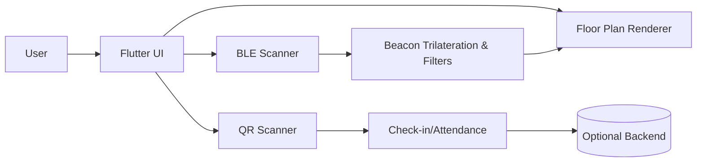

# 교내 실내 지도 앱 (Indoor Campus Map)

> **실내 위치 추적 + 층별 도면 내 내 위치 표시 + QR 출석**을 한 앱에서.
> 상업성을 고려한
> **비콘 기반 실내 내비게이션·QR 출석·시설 정보 연계** MVP.

---

## ⚡️ 핵심 요약

* **문제**: 복잡한 교내 건물에서 강의실/시설 탐색이 어렵고, 출석·시설 안내가 분절적.
* **해결**: 층별 도면 위에 현재 위치(비콘/BLE)와 **목적지 경로 힌트**, **QR 출석**을 통합 제공.
* **차별점**: 지도/출석/시설 정보를 **한 화면 흐름**으로 연결, **오프라인 환경**에서도 동작 가능한 **도면 기반 렌더링**.

---

## 🧭 주요 기능 (Features)

* **실내 지도(층별 도면) 뷰어**: Pinch-to-zoom, 드래그, 실 좌표 스케일링.
* **내 위치 표시(β)**: BLE Beacon RSSI 스캔 → 도면 좌표로 매핑(삼변측량 기반/보정 지원 예정).
* **빠른 탐색**: 대표 강의실/시설 바로가기, 즐겨찾기(계획), 최근 방문(계획).
* **QR 출석**: 강의실/시설 QR 스캔 → 출석/체크인 이벤트 발행(백엔드 연동 가능 구조).
* **시설 정보 패널**: 강의시간표/시설혼잡도/운영시간(데이터 연동 포인트 제공).
* **오프라인 우선 설계**: 도면/좌표 캐시, 네트워크가 없어도 기본 탐색 가능.

---

## 📱 스크린샷


| 홈/메뉴                                 | 층 도면                                   | QR 스캔                            | 내 위치                                     |
| ------------------------------------ | -------------------------------------- | -------------------------------- | ---------------------------------------- |
|  |  |  |  |

---

## 🏗️ 아키텍처 개요

* **Flutter (Dart)** 단일 코드베이스
* **Presentation**: `screens/*`, `widgets/*`
* **Domain**: 위치 추정·좌표 매핑, QR 스캔, 룸 메타데이터
* **Data**: 도면 리소스(`assets/`), 비콘 앵커(예정: `assets/json/beacons.json`)



---

## 📂 주요 파일 안내 (이 리포지토리 기준)

> **아래 파일명은 현재 프로젝트에 포함된 실제 파일명과 매핑됩니다.**

* `lib/main.dart` — 앱 진입점, 라우트 초기화
* `lib/menu.dart` — 홈/메뉴 화면(UI 진입 허브)
* `lib/campus_map_screen.dart` — 캠퍼스/건물 선택 및 층 진입
* `lib/locate_button.dart` — 내 위치 갱신/표시 버튼 위젯
* `lib/qr_button.dart` — QR 진입 버튼 위젯
* `lib/qr_floor_scanner_widget.dart` — 층 도면 위 QR 스캐너 뷰(오버레이)

폴더

```
lib/
 ├─ screens/
 │   ├─ campus_map_screen.dart
 │   └─ floor/
 │       └─ building_floor_screen.dart
 ├─ widgets/
 │   ├─ locate_button.dart
 │   ├─ qr_button.dart
 │   └─ qr_floor_scanner_widget.dart
 ├─ data/
 │   ├─ rooms.json           # 강의실/시설 좌표 메타데이터
 │   ├─ beacons.json         # 비콘 앵커 좌표/UUID/TxPower
 │   └─ schedules.json       # 시간표/운영시간
 ├─ core/
 │   ├─ ble/
 │   │   ├─ scanner.dart     # flutter_beacon or flutter_blue_plus 래퍼
 │   │   └─ trilateration.dart# 위치 추정(가중/칼만필터 옵션)
 │   ├─ qr/
 │   │   └─ qr_service.dart  # qr_code_scanner/mobile_scanner 래퍼
 │   └─ map/
 │       └─ coord_mapper.dart# 픽셀↔실좌표 변환, 보정
 └─ main.dart
```

---

## 🔧 개발·실행 방법

### 필수 요구사항

* Flutter 3.x 이상, Dart SDK 호환
* Android Studio 또는 VS Code + Flutter/Dart 확장
* (Android) SDK 33+, NDK/Gradle 호환 환경

### 권장 패키지(변경 가능)

* **BLE**: `flutter_beacon` 또는 `flutter_blue_plus`
* **QR**: `qr_code_scanner` 또는 `mobile_scanner`
* **상태관리**: `provider` / `riverpod` (선택)

### 설치

```bash
# 1) 저장소 클론
$ git clone https://github.com/<ORG_OR_USER>/<REPO>.git
$ cd <REPO>

# 2) 의존성 설치
$ flutter pub get

# 3) 실행 (디바이스 연결 후)
$ flutter run -d <deviceId>
```

### Android 권한 설정 (중요)

`android/app/src/main/AndroidManifest.xml`

```xml
<!-- BLE 스캔/연결 권한 (Android 12+) -->
<uses-permission android:name="android.permission.BLUETOOTH_SCAN" />
<uses-permission android:name="android.permission.BLUETOOTH_CONNECT" />
<uses-permission android:name="android.permission.ACCESS_FINE_LOCATION" />
<uses-permission android:name="android.permission.ACCESS_COARSE_LOCATION" />

<!-- QR 카메라 권한 -->
<uses-permission android:name="android.permission.CAMERA" />
```

런타임 권한 요청 로직을 초기 진입 또는 기능 사용 시 트리거하세요.

### iOS 설정(선택)

`Info.plist`에 Bluetooth/Camera 사용 사유(NSBluetooth\*, NSCameraUsageDescription) 추가.

---

## 🗺️ 도면 좌표 매핑 (요점)

* **기준 이미지 크기**: 예) 349×227(px) → 실제 미터 단위 스케일 정의
* **앵커(비콘) 좌표**: 도면 픽셀 좌표로 등록 → 실제 거리 변환 함수 제공
* **삼변측량** + **가중치(RSSI/TxPower)** + **이동 평균/칼만 필터**로 잡음 억제
* **스냅핑**: 복도/출입구/계단 등 그래프 위로 스냅하여 시각적 점프 감소(계획)

---

## 🚀 사용 흐름

1. **건물/층 선택** → 2) **도면 로드** → 3) **내 위치 버튼**으로 스캔 시작 →
2. **도면 상 내 위치 표시** → 5) **QR 버튼**으로 출석/체크인

---

## 🔌 백엔드 연동 포인트

* 출석 이벤트 POST: `/api/attendance/check-in` (body: userId, roomId, time, method=QR/BLE)
* 시설/시간표 조회: `/api/facility/:id`, `/api/schedule/:room`

> 현재 저장소는 **프런트(Mobile Flutter)** 중심. 서버 스펙은 `docs/api.md`로 분리 권장.

---

## 🧪 로컬 디버깅 팁

* `Expected to find project root` 오류 → 터미널의 **현재 폴더가 프로젝트 루트인지** 확인.
* Gradle/SDK 충돌 → `flutter clean && flutter pub get` 후 다시 빌드.
* Android 12+ BLE 스캔 안 됨 → **BLUETOOTH\_SCAN/CONNECT** 권한 + 위치 권한 **런타임 요청** 체크.
* QR 미동작 → 카메라 권한, 에뮬레이터 대신 실제 디바이스 권장.

---

## 🧭 브랜치 전략 & 커밋 컨벤션

* 기본: `dev` = 통합 개발 브랜치, `one` = 개인 작업 브랜치(예시). PR → `dev` 병합.
* 긴급 픽스: `hotfix/*`, 기능: `feat/*`, 리팩터: `refactor/*`
* **Conventional Commits** 권장:

  * `feat: BLE 스캔 가중 보정 추가`
  * `fix: QR 스캐너 초기화 크래시 해결`
  * `docs: README 좌표매핑 가이드 보강`

---

## 🗺️ 로드맵 (Roadmap)

* [ ] 층별 도면 뷰어/줌/드래그
* [ ] QR 스캔 진입/위젯 구조
* [ ] Beacon 스캔 래퍼 통합(`flutter_beacon`/`flutter_blue_plus` 선택 고정)
* [ ] 좌표 매핑 유틸(픽셀↔미터 변환) + 오차 보정
* [ ] 필터(이동 평균/One Euro/칼만) 적용 옵션화
* [ ] 경로 스냅 & 장애물 맵 고려
* [ ] 즐겨찾기/최근 방문/시설 혼잡도 연계
* [ ] 백엔드 출석 API 연동 샘플

> **마감 기준**: 학기 캡스톤 일정(5월 말) → 이후 유지보수/상품화 단계.

---

## 🧩 기여 (Contributing)

1. 이슈 등록 → 재현 방법/기대/실제 결과 첨부
2. 브랜치 생성 → PR → 리뷰 후 병합
3. 스타일: Dart format, analyzer 경고 0 유지

---

## 🔒 라이선스

* MIT (필요시 학교/학과 명시)

---

## 📬 문의

* Maintainer: 팀장/담당자 
* 이슈/기능요청: GitHub Issues 이용

---

## 부록 A. 빠른 임베드 코드 스니펫

> 버튼/위젯을 다른 화면에 붙일 때 참고

```dart
// QR 버튼 예시
import 'package:your_app/widgets/qr_button.dart';
...
QRFab(onScan: () { /* TODO: handle result */ });
```

```dart
// 내 위치 버튼 예시
import 'package:your_app/widgets/locate_button.dart';
...
LocateFab(onLocate: () { /* TODO: start BLE scan */ });
```

---
